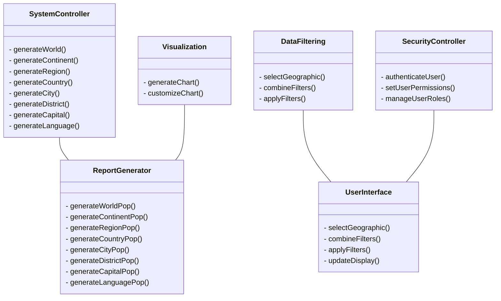

```mermaid
classDiagram
    class SystemController {
      - generateWorld()
      - generateContinent()
      - generateRegion()
      - generateCountry()
      - generateCity()
      - generateDistrict()
      - generateCapital()
      - generateLanguage()
    }
    class DataFiltering {
      - selectGeographic()
      - combineFilters()
      - applyFilters()
    }
    class UserInterface {
      - selectGeographic()
      - combineFilters()
      - applyFilters()
      - updateDisplay()
    }
    class ReportGenerator {
      - generateWorldPop()
      - generateContinentPop()
      - generateRegionPop()
      - generateCountryPop()
      - generateCityPop()
      - generateDistrictPop()
      - generateCapitalPop()
      - generateLanguagePop()
    }
    class SecurityController {
      - authenticateUser()
      - setUserPermissions()
      - manageUserRoles()
    }
    class Visualization {
      - generateChart()
      - customizeChart()
    }
    
    SystemController -- ReportGenerator
    DataFiltering -- UserInterface
    SecurityController -- UserInterface
    Visualization -- ReportGenerator
```

