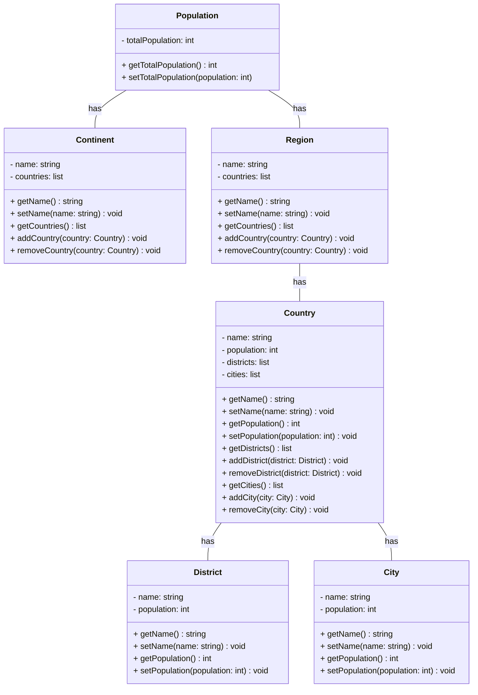

```mermaid
classDiagram
    class Population {
        - totalPopulation: int
        + getTotalPopulation()int
        + setTotalPopulation(population: int)
    }
    class Continent {
        - name: string
        - countries: list<Country>
        + getName() string
        + setName(name: string) void
        + getCountries() list<Country>
        + addCountry(country: Country) void
        + removeCountry(country: Country) void
    }
    class Region {
        - name: string
        - countries: list<Country>
        + getName() string
        + setName(name: string) void
        + getCountries() list<Country>
        + addCountry(country: Country) void
        + removeCountry(country: Country) void
    }
    class Country {
        - name: string
        - population: int
        - districts: list<District>
        - cities: list<City>
        + getName() string
        + setName(name: string) void
        + getPopulation() int
        + setPopulation(population: int) void
        + getDistricts() list<District>
        + addDistrict(district: District) void
        + removeDistrict(district: District) void
        + getCities() list<City>
        + addCity(city: City) void
        + removeCity(city: City) void
    }
    class District {
        - name: string
        - population: int
        + getName() string
        + setName(name: string) void
        + getPopulation() int
        + setPopulation(population: int) void
    }
    class City {
        - name: string
        - population: int
        + getName() string
        + setName(name: string) void
        + getPopulation() int
        + setPopulation(population: int) void
    }

    Population -- Continent : has
    Population -- Region : has
    Region -- Country : has
    Country -- District : has
    Country -- City : has

```

