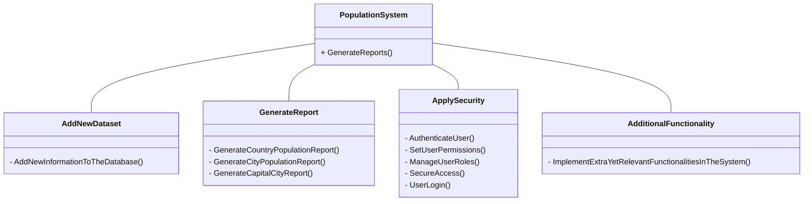

```mermaid
classDiagram
    class PopulationSystem {
        + GenerateReports()
    }

    class AddNewDataset {
        - AddNewInformationToTheDatabase()
    }

    class GenerateReport {
        - GenerateCountryPopulationReport()
        - GenerateCityPopulationReport()
        - GenerateCapitalCityReport()
    }

    class ApplySecurity {
        - AuthenticateUser()
        - SetUserPermissions()
        - ManageUserRoles()
        - SecureAccess()
        - UserLogin()
    }

    class AdditionalFunctionality {
        - ImplementExtraYetRelevantFunctionalitiesInTheSystem()
    }

    PopulationSystem -- AddNewDataset
    PopulationSystem -- GenerateReport
    PopulationSystem -- ApplySecurity
    PopulationSystem -- AdditionalFunctionality
```
